<h1>Comparing-Classifiers</h1>
This python application using jupyter notebookm compares the results of k-nearest neighbors, logistic regression, decision trees, and support vector machines classification models using dataset related to the marketing of bank products over the telephone.

 
The current CRISP-DM Process Model for Data Mining (see Figure 1) was followed.

 
 

<h4 align="center"> Figure 1</h4>

<h2>Business Understanding</h2>
The Business goal is  to come up with a machine learning classification model to identify if a future client will subscribe a term deposit or not based on several independent variables such as education level, marital status, if has housing loan or not, personal loan or not, etc. The machine learning classification model is selected by ranking up four different machine learning models: KNeighborsClassifier, Logistic Regression, Support Vector Machine, and Decision Tree by their metrics and other indicators such as the Precision-recal curve, and confusion matrix. The dataset used to train those four models is related to the marketing of bank products over the telephone as mentioned before. The analysis will be done using python & jupyter notebook.

<h2>Data Understanding</h2>
The original dataset (bank-full.csv) given is in .csv format.It consists of 17 columns and 6316 rows as shown below. The target/independent columns is "y" which is categorical (nominal feature), and it stands for: has the client subscribed a term deposit?. This variable is imbalance as will be later be seen. There are only two numerical columns: "age","balance", and "pdays" since the column: "duration" is only for benchmark purposes and is discarded for realistic predictive modelling, and the columns" day" and "month" were not considered numerical for obvious reason during the classification process..The rest of the columns are categorical (nominal). Most of the dataset provided is imbalanced before entering the modeling phase. None of the columns contain "NaN" values. Duplicates were not observed. It is thought that in order to provide more insight into the aforementioned dataset, a data preparation,i.e, data cleaning process needs to be done first.

 
 

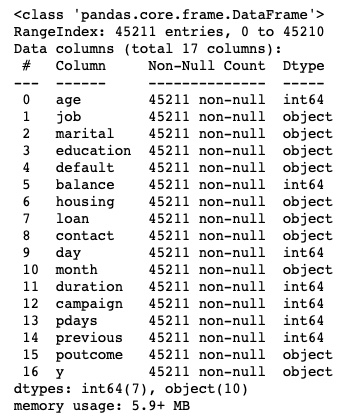
<h4 align="center"> Figure 2</h4>

 

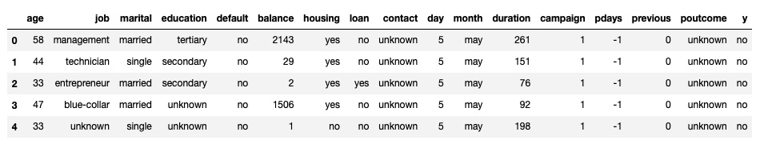
<h4 align="center"> Figure 3</h4>

<h2>Data Preparation</h2>
The first step was check if there were any null values, and also make sure that there was not duplicates present in the dataset as well. As it is observed in Figure 4, there were initially no null values nor duplicates.

 
 

<h4 align="center"> Figure 4</h4>

Columns: "job", "education", "poutcome", and "contact" have a feature with the same name: "unknown", so it was decided to replace it wiht different name to avoid potential problems in the foregoing analysis as indicated by Figure 5:

 

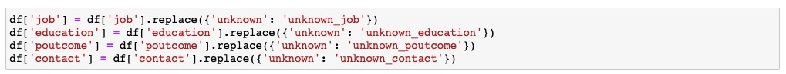
<h4 align="center"> Figure 5</h4>

More insight into the dataset can be gained before finalizing the data preparation by doing the histograms for most of the categorical columns as shown on Figures 6, 7, and 8. All categorical columns/independent variables are nominal.

 

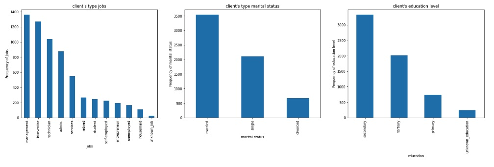
<h4 align="center"> Figure 6</h4>

 

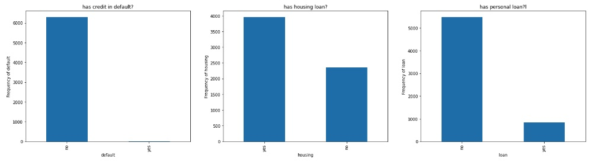
<h4 align="center"> Figure 7</h4>

 

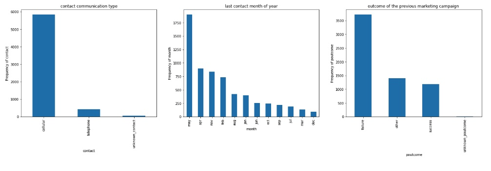
<h4 align="center"> Figure 8</h4>

<h3>Treatment of Outliers in Numerical Columns: "age", "balance", and "pdays"</h3>
The presence of outliers in the numerical columns: 'age", "balance", and "pdays" (see Figures 9, 10 and 11) indicated by the respective boxplot demands a careful and efective treatment before moving into the modeling phase. The histograms of the aforementioned columns have been also added for completeness.

 

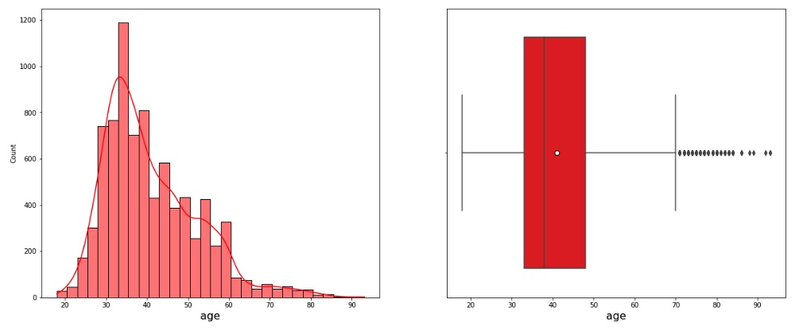
<h4 align="center"> Figure 9</h4>

 

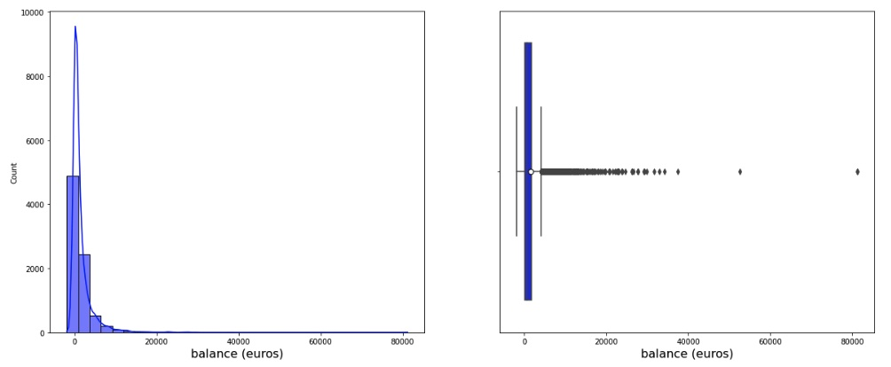
<h4 align="center"> Figure 10</h4>

 

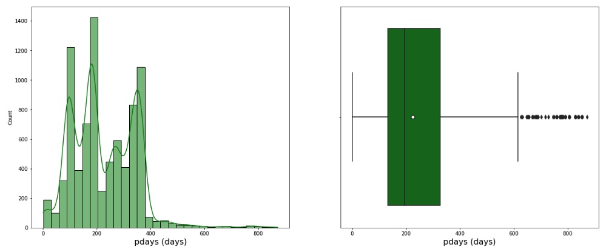
<h4 align="center"> Figure 11</h4>

One passes was applied to the aforementioned columns in order to remove the outliers. The values equal to -1 was removed from the column "pdays". The aforementioned pass consisted on applying the well known Inter quartile range (IQR) method. Figure 13, 14, and 15 shows the final results after applying this method to remove the outliers. As it can be observed, this pass was very effective, i.e., removing the majority of the outliers. As an additional comments, the target column "balance" shows a distribution skewed to the left, i.e, it was felt there was no need  to use its logarithm during modelling phase.

 
 

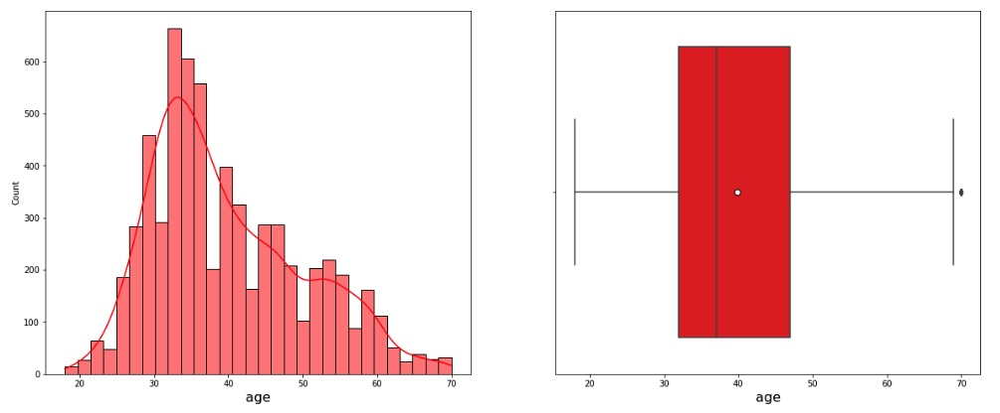
<h4 align="center"> Figure 12</h4>

 
 

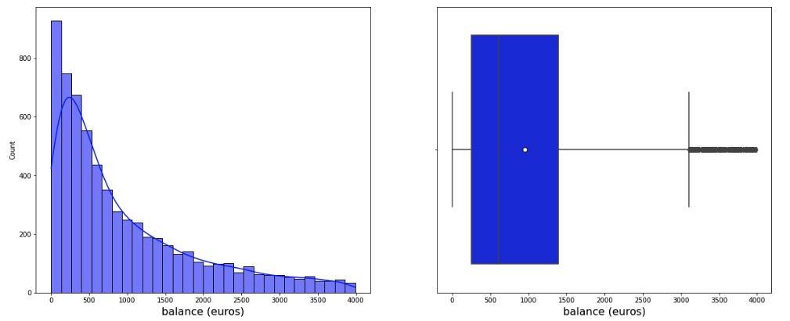
<h4 align="center"> Figure 13</h4>

 
 

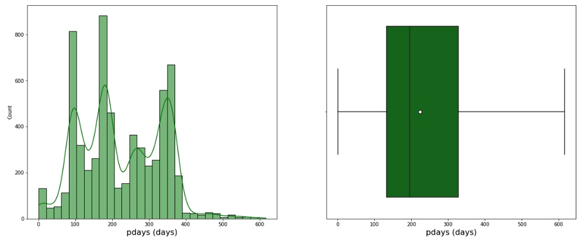
<h4 align="center"> Figure 14</h4>

<h4>Treatment of Categorical Features</h4>

<h3>Nominal Features</h3>
Nominal features are categorical features that have no numerical importance. Order does not matter. Most of the columns were found to fall in this category as follows: "job", "eudcation","contact","month", "day", "marital",and "poutcome". The Pandas getdummies function was used to creates dummy variables was used to treat them. A dummy variable is a numerical variable that encodes categorical information, having two possible values: 0 or 1. 
Those encoded features were added to the existing dataset using the panda function contact as shown  on Figure :

 

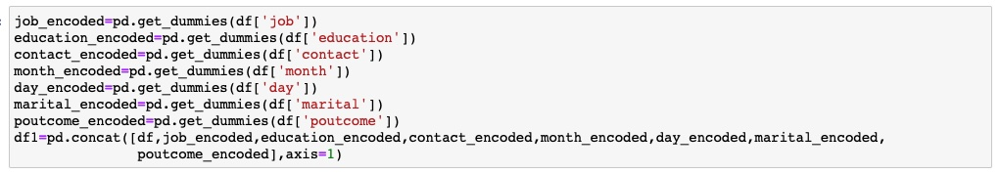
<h4 align="center"> Figure 14</h4>

Binary data is also nominal data, meaning they represent qualitatively different values that cannot be compared numerically.There were three independent variables considered as binary: 'default' 'housing', ;'loan' all of them with 'yes' and 'no'.

 

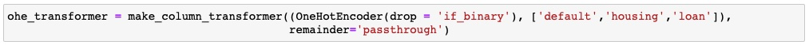
<h4 align="center"> Figure 14</h4>

<h3>Ordinal Features</h3>
None of the independent variables were considered to be treated as a ordinal feature, not even poutcome, since there were a bunch of 'unknown' and 'other' items listed, beside 'failure' and 'success'.

Since, most of the columns have values between 0 or 1, it was decided to scale the columns: "balance" as follow:

 

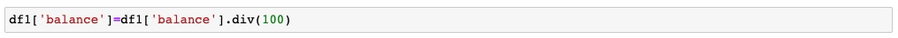
<h4 align="center"> Figure 14</h4>

