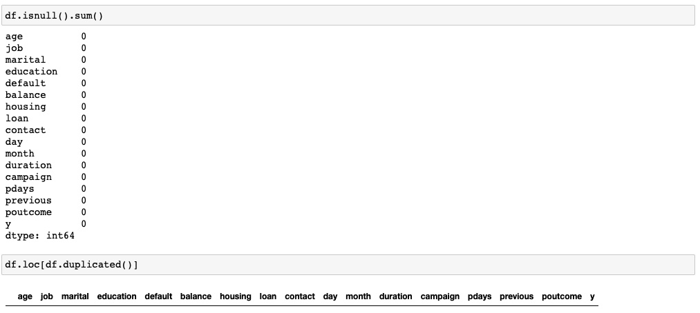

<h1>Comparing-Classifiers</h1>
This python application using jupyter notebookm compares the results of k-nearest neighbors, logistic regression, decision trees, and support vector machines classification models using dataset related to the marketing of bank products over the telephone.

 
The current CRISP-DM Process Model for Data Mining (see Figure 1) was followed.

 
 

<h4 align="center"> Figure 1</h4>

<h2>Business Understanding</h2>
The Business task is identify which client will subscribe a term deposit or not based on several independent factors by using different machine learning classification models: KNeighborsClassifier, Logistic Regression, Support Vector Machine, and Decision Tree. The best model will be selected by comparing their metrics, and other indicator such as the Precision-recal curve, and confusion matrix. The analysis will be done using python & jupyter notebook.

<h2>Data Understanding</h2>
The original dataset (bank-full.csv) given is in .csv format.It consists of 17 columns and 6316 rows as shown below. The target/independent columns is "y" which is categorical (nominal feature), and it stands for: has the client subscribed a term deposit?. This variable is imbalance as will be later be seen. There are only two more columns numerical: "age" and "balance", i.e., since the column: "duration" should only be included for benchmark purposes and should be discarded if the intention is to have a realistic predictive model.The rest of the columns are categorical (nominal). Consequently, most of the dataset provided will be imbalanced before entering the modeling phase. None of the columns contain "NaN" values. Duplicates were not observed. It is thought that in order to provide more insight into the aforementioned dataset, a data preparation,i.e, data cleaning process needs to be done first.

 

<h4 align="center"> Figure 2</h4>

 
 

<h4 align="center"> Figure 3</h4>

<h2>Data Preparation</h2>
The first step was check if there were any null values (see Figure 3), and also make sure that there was not duplicates present in the dataset as well. As it is observed in Figure 4, all the columns now have same number of rows with no null values.

 

<h4 align="center"> Figure 4</h4>

